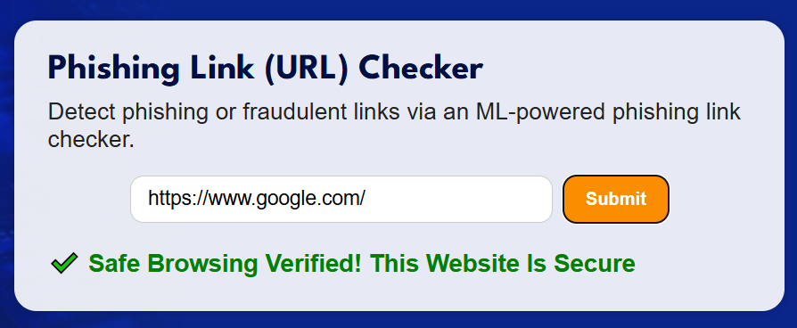

# Fishers - Flask-based Phishing Detection Web App

**Fishers** is a web application that identifies phishing websites based on machine learning. It assists in confirming whether a specified URL is secure or dangerous. The system utilizes a trained ML model to analyze structural and behavioral features of the URLs and display results in a simple, intuitive interface.


## Features

- **URL Safety Detection**
- Enter a URL and get immediate analysis on safety or suspicion
- Displays crisp visual cues along with informative feedback messages

- **Machine Learning Integration**
- Trained on a dataset of more than 30+ engineered URL-based features
- Very high accuracy in separation between legitimate and phishing links

- **Interactive Web Interface**
- Simple UI for input and output
- Spinner and result messages show up only upon user submission

- **Responsive Design**
- Desktop-ready layout with styled inputs and feedback
- Clean, readable design with branded color scheme


## Tech Stack

- **Frontend**: HTML, CSS, JavaScript
- **Backend**: Python, Flask
- **Machine Learning**: scikit-learn (trained classifier)
- **Utilities**: Feature extraction module, dynamic result display


## Getting Started

```bash
# 1. Activate the virtual environment
.venv\Scripts\activate

# 2. Move into the main directory
cd main

# 3. Start the Flask application
python app.py
```


## Project Structure

```bash
Fishers/
│
├── main/
│   ├── app.py                  # Flask backend
│   ├── phishing_classifier.pkl # Trained ML model
│   ├── feature_extraction.py   # Feature extraction logic
│   ├── phishing_detection.ipynb# ML training notebook
│   ├── dataset.csv             # Training data
│   ├── static/
│   │   ├── fishers.css         # Custom styles
│   │   ├── fishers.js          # JS logic (URL check and display)
│   │   ├── phishing_logo.png   # Logo image
│   │   └── other images...     # Supporting visuals
│   └── templates/
│       └── fishers.html        # Main HTML template
├── README.md
└── requirements.txt
```


## Screenshots

1. **Home Page** – Shows the header bar with Fishers logo, and Phishing Detector title

2. **Submit Button & Loading** – A buffering icon appears after pressing submit button, meaning the model is processing the link.

3. **Safe URL** – It displays a success message when the URL is safe.

4. **Phishing URL** – It displays a warning message when phishing link is detected by it.

5. **Phishing Facts** – This section explains about phishing attacks.

6. **Footer Section** – the hackathon team's information written in the footer.


## Setup Instructions

1. Clone the Repository
```bash
git clone https://github.com/your-username/Fishers.git
cd Fishers
```

2. Set Up Environment (Windows)
```bash
python -m venv .venv
.venv\Scripts\activate
pip install -r requirements.txt
```

3. Run the App
```bash
cd main
python app.py
```

4. Access Locally
Once the server starts, open your browser and navigate to:
```bash
http://127.0.0.1:5000/
```


## Future Work
- Introduce browser extension for real-time scanning of URLs
- Include threat intelligence APIs to improve detection
- Support mobile-friendly UI and dark mode support


## Caught and coded by Team Fishers
- Sneha Subbarayudu (sbayanab@gitam.in)
- Keerthi Ummiti (mummiti@gitam.in)
- Abhishek Karthik (akarthik2@gitam.in)
- Daksh Mohan (mdaksh@gitam.in)
- Helly Khatri (hkhatri@gitam.in)
- Punit Javvaji (pjavvaji@gitam.in)